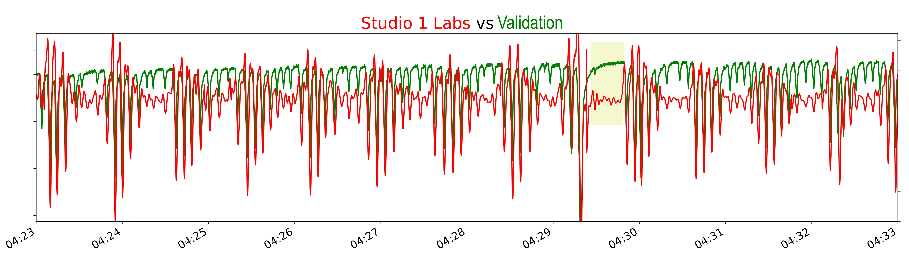

# Apnea mock-up project

## Background:

Imagine you started working at a company that developed a new monitoring device/sensor. For example it could be a new wearable ECG device, or Pulse oximeter or any other personal health related gadget. 

The company asks you to make this device smart and intelligent so that it can detect abnormality in health conditions. For example, personal [ECG device](https://stanfordmlgroup.github.io/projects/ecg/) should be able to detect and classify heart related diseases. 

To make a device smart, there are two main paths to take (see the diagram below):
1) First, if it is possible and feasible, do a hard coding of the rules -  Software Engineering path  
2) If the first path is not feasible, but you have lots of data, either your own or open-sourced, then you can choose Machine Learning (ML) path and build data-based model (aka Supervised learning)  

But because this is a new device or type of sensor, the chances are neither of two paths above can be done right away.

Supervised ML route can be pursued only after a data collection and labelling. Parallel to data collection,  you will most likely need to validate new device against standard technology in the industry. Clinical validation and data collection/labeling can be costly. In order to address both validation and collection/labelling with fewer financial expenses, an alternative way of achieving your goal can be done. 

## Clinical validation and data collection/labelling with less financial expenses

- First, when planning clinical validation you will need to find an open-source data which will be very similar, in terms of signals/equipment and clinical conditions that it addresses, to the equipment that you will be using as a gold standard to validate new gadget against.

- Second, you collect data from a group of participants that have similar health conditions that open-source data is addressing. Plus, you will need to simultaneously collect data from a new gadget and the equipment you validating your technology against (in another words - similar to one that was used during open-source data collection).

- Third, you need to build ML model using open-source dataset.

- Next, you use trained ML model with input data from gold standard equipment that you are validating against, to label your new clinical dataset.

- In the last step, you build a new ML model using signals only from a new gadget and labels that were obtained in the previous step (Supervised learning with labels obtained from a clinical grade devices).

This way, by the end of the project you should have validation and working ML model for a new gadget.

# My story:

I had a similar story as above when I joined [Studio 1 Labs](https://www.studio1labs.com), but instead of ECG gadget the company was developing new textile sensors that can output respiratory signal and heart rate. 

We needed a validation against clinical practices (vital sign measurement by a nurse) or equipment that can be used as a gold standard. In addition, since the textile sensor was made as a bedsheet, we wanted to see if we can detect sleep disorder conditions, such as sleep apnea. In the plot below you can see a 10-minute record of filtered respiratory signal from a bedsheet (red) in comparison with a validation device (green). Both technologies can detect deep/shallow respiration cycles as well as stoppage in breathing between 4:29 AM and 4:30 AM.

# Repository

This repository is a mock-up of the steps that were discussed above.
- [First notebook](code/1_Data_Preparation.ipynb) explores public dataset [from PhysioNet](https://physionet.org/physiobank/database/challenge/2018/) that can be used to build ML model for apnea detection.
- In the [second notebook](code/2_Model_training.ipynb) a deep learning model #1 for binary classification is built and trained
- [Third notebook](code/3_Transfer.ipynb) uses trained model to label different dataset #2 for apnea events
- And finally dataset #2 (using 1 signal out of 3) with new labels is used to train ML model #2 for apnea detection
